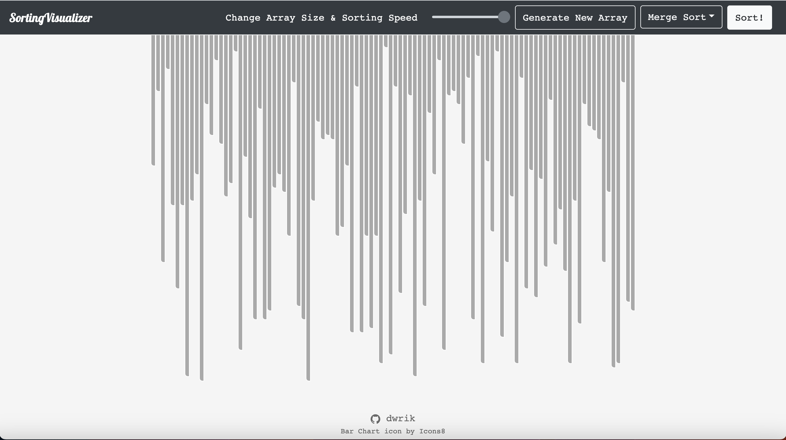

# Sorting Visualizer

React application to visualize the working of popular sorting algorithms.

## Features

- Visualize 5 of the most popular sorting algorithms
- Change size of the dataset
- Change the animation speed
- Generate random dataset

## Implemented Algorithms

- Merge Sort
- Quick Sort
- Heap Sort
- Bubble Sort
- Selection Sort
